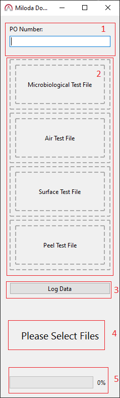
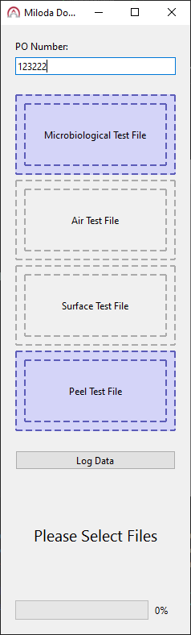
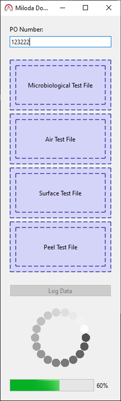
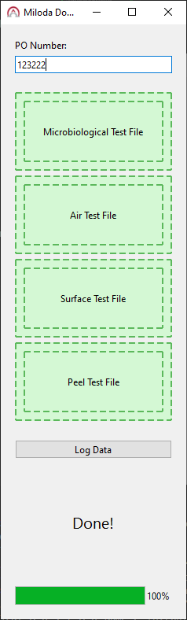
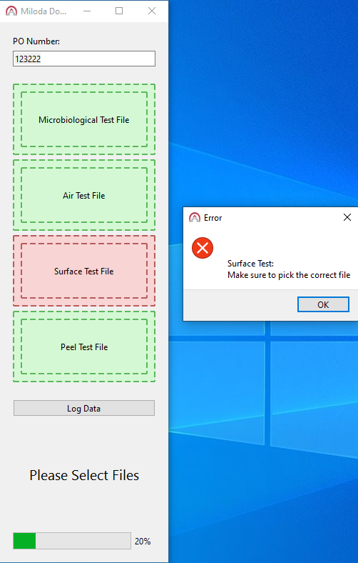

# Miloda Report Generator

## Description
The project automates the documentation process for the test results of sterilization and cleaning monitoring at Alpha Omega. It covers Package Integrity, Surface, Air and Microbiological Tests Reports received by Miloda Labs.

## Installation
### Requirements

* Windows 10 or later
* PowerShell
* Python 3.11

### Setup

* Move the project files to the desired location
* Open PowerShell terminal
* Navigate to the project directory
* Run the file `install.ps1`
* Wait for the installation to complete
* If more than 20 minutes have passed and no progress is made, press enter or exit the PowerShell and repeat the process
* Right click on `main.ps1`
* Press on **Change** button that's beside **Opens with:**
* Choose **Windows PowerShell**

## How to use

* Double Click on **main.ps1**
* For the first run, the program may take a couple of minutes to run
* The program window should look same as the picture below



1.  PO Number input
2. File Input Field (File Selection or Drag & Drop)
3. Data Processing Button
4. Program Dialog
5. Progress Bar

* Enter a PO Number in the designated field
* Select files for processing by either clicking on an input field or by drag & drop the file to the designated field
* If you select or drag & drop a file, its field should turn blue



* Enter all required input fields
* Press `Log Data` button
* A spinner should show up in the program dialog indicating that file processing is underway



* Wait until processing is finished
* When processing is over, the program dialog should display `Done!` and all file input fields shoud turn green



* If the program runs through an error, a pop up window should show up alarming the user of the error.



* Navigate to the desktop
* A folder with the PO Number should have been created with the input files copied to it and renamed after the PO Number and the test name
* The report should be in the same folder and named after the PO Number in DOCX file format.

## File Structure

```
project_root/
├── main.py
├── install.ps1
├── main.ps1
├── requirements.txt
├── .vscode/
│   └── launch.json
├── gui/
│   ├── __init__.py
│   ├── draggable_frame.py
│   ├── file_picker_widget.py
│   ├── log_data_widget.py
│   ├── main_window.py
│   ├── po_input_widget.py
│   └── spinner_widget.py
├── logic/
│   ├── __init__.py
│   ├── data_logger.py
│   ├── file_processor.py
│   ├── ocr_processor.py
│   ├── po_data_extractor.py
│   ├── processing_worker.py
│   └── report_generator.py
├── resources/
│   ├── __init__.py
│   ├── img/
│   │   ├── AO-icon.ico
│   │   └── spinner.gif
│   ├── others/
│   ├── styles/
│   │   └── main.qss
│   ├── temp/
│   └── templates/
│       └── template.docx
├── assets/
└── README.md
```
